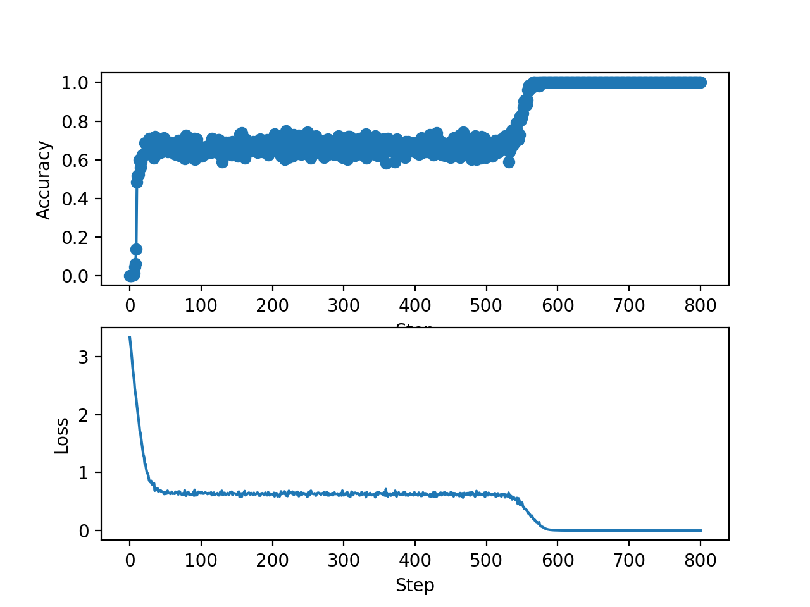

# Deep-learning

## MLP and CNN
### Evaluating the gradients
#### Linear module
In this section, we are calculating the gradients for the linear module. We find closed form expressions for $\frac{\partial L}{\partial W}$, $\frac{\partial L}{\partial b}$, $\frac{\partial L}{\partial x}$.

$\textbf{Y} = \textbf{XW}^{T} + \textbf{B}\Rightarrow Y_{mn}=\sum_{p}X_{mp}W^{T}_{pn} + b_{mn}=\sum_{p}X_{mp}W_{np} + b_{mn}$

First we focus on the partial derivative with respect to the weights. Then, 
$\Big[\frac{\partial L}{\partial W}\Big]_{ij}=\sum_{mn}\frac{\partial L}{\partial Y_{mn}}\frac{\partial Y_{mn}}{\partial W_{ij}}$. We just need to calculate $\frac{\partial Y_{mn}}{\partial W_{ij}}$, because $\frac{\partial L}{\partial \textbf{Y}}$ is provided by the next module during backprop.

$\frac{\partial Y}{\partial W_{ij}} = \sum_{p}X_{mp}\frac{\partial W_{np}}{\partial W_{ij}}= \sum_{p}X_{mp}\delta_{ni}\delta_{pj}=\delta_{ni}X_{mj}$

$\frac{\partial L}{\partial W_{ij}} = \sum_{mn}\frac{\partial L}{\partial Y_{mn}}\delta_{ni}X_{mj} = \sum_{m}\Big(\frac{\partial Y}{\partial Y}\Big)^{T}_{im}X_{mj}\Rightarrow \frac{\partial L}{\partial \textbf{W}} = \frac{\partial L}{\partial \textbf{Y}}^{T}\textbf{X}$

Now, we calculate the gradient with respect to the bias term. Then, $\Big[\frac{\partial L}{\partial b}\Big]_{ij}=\sum_{mn}\frac{\partial L}{\partial Y_{mn}}\frac{\partial Y_{mn}}{\partial b_{ij}}$. We just need to calculate $\frac{\partial Y_{mn}}{\partial b_{ij}}$, because $\frac{\partial L}{\partial \textbf{Y}}$ is provided by the next module during backprop. 
    
$\frac{\partial Y_{mn}}{\partial b_{ij}} = \textbf{1}_{mn}$

$ \frac{\partial L}{\partial \textbf{b}} = \sum_{mn}\frac{\partial L}{\partial Y_{mn}}1_{mn}\Rightarrow\frac{\partial L}{\partial \textbf{b}} = \frac{\partial L}{\partial \textbf{Y}}\textbf{1}$

Now, we calculate the gradient with respect to the inputs. Then, $\Big[\frac{\partial L}{\partial X}\Big]_{ij}=\sum_{mn}\frac{\partial L}{\partial Y_{mn}}\frac{\partial Y_{mn}}{\partial X_{ij}}$. We just need to calculate $\frac{\partial Y_{mn}}{\partial X_{ij}}$, because $\frac{\partial L}{\partial \textbf{Y}}$ is provided by the next module during backprop. 

$\frac{\partial Y}{\partial X_{ij}} = \sum_{p}W_{np}\frac{\partial X_{mp}}{\partial X_{ij}}= \sum_{p}W_{np}\delta_{mi}\delta_{pj}=\delta_{mi}W_{nj}$
    
$\frac{\partial L}{\partial X_{ij}} = \sum_{mn}\frac{\partial L}{\partial Y_{mn}}\delta_{mi}W_{nj} = \sum_{n}\frac{\partial L}{\partial Y_{in}}W_{nj}\Rightarrow \frac{\partial L}{\partial \textbf{X}} = \frac{\partial L}{\partial \textbf{Y}}\textbf{W}$

#### Activation module
We consider an element wise activation module such that $Y_{ij} = h(X_{ij})$ and we need to calculate $\frac{\partial L}{\partial \textbf{X}}$. Then, $\Big[\frac{\partial L}{\partial X}\Big]_{ij}=\sum_{mn}\frac{\partial L}{\partial Y_{mn}}\frac{\partial Y_{mn}}{\partial X_{ij}}$. We just need to calculate $\frac{\partial Y_{mn}}{\partial X_{ij}}$, because $\frac{\partial L}{\partial \textbf{Y}}$ is provided by the next module during backprop. 

$\frac{\partial Y_{mn}}{\partial X_{ij}} = \frac{\partial h}{\partial X_{ij}} = \frac{\partial h(X_{mn}}{\partial X_{ij}}\frac{X_{mn}}{\partial X_{ij}} = \frac{\partial h}{\partial X_{ij}}\delta_{mi}\delta_{nj}$
    
$\frac{\partial L}{\partial X_{ij}} = \sum_{mn}\frac{\partial L}{\partial Y_{mn}}\frac{\partial h}{\partial X_{ij}}\delta_{mi}\delta_{nj} = \frac{\partial L}{\partial Y_{ij}}\frac{\partial h}{\partial X_{ij}}\Rightarrow \frac{\partial L}{\partial \textbf{X}} = \frac{\partial L}{\partial \textbf{Y}}\circ\frac{\partial h}{\partial \textbf{X}}$

#### Softmax and loss modules
We will consider the element wise activation function to be softmax and we will calculate its gradient with respect to the input. The softmax function is defined as follows $Y_{ij} = \frac{e^{X_{ij}}}{\sum_{k}e^{X_{ik}}}$. We need to calculate $\frac{\partial h}{\partial \textbf{X}}$. 

$\frac{\partial h}{\partial X_{ij}} = \frac{\partial h_{mn}}{\partial X_{ij}} = \frac{e^{X_{mn}}}{\sum_{k}e^{X_{mk}}}\Bigg[\frac{\delta_{mi}\delta_{jn}\sum_{k}e^{X_{mk}} - e^{X_{mj}}\delta_{mi}}{\sum_{k}e^{X_{mk}}}\Bigg] = \frac{\delta_{mi}e^{X_{mn}}}{\sum_{k}e^{X_{mk}}}\Bigg[\delta_{jn} - \frac{e^{X_{mj}}}{\sum_{k}e^{X_{mk}}}\Bigg]$

For this to work, we will need m=i all the time. Then, we evaluate 2 cases, one when j=n and one when $j\neq n$.
When j=n, we have:
$$
\frac{\partial L}{\partial \textbf{X}} = \frac{\partial L}{\partial Y_{ij}}\frac{e^{X_{in}}}{\sum_{k}e^{X_{ik}}}\Bigg(1 - \frac{e^{X_{ij}}}{\sum_{k}e^{X_{ik}}}\Bigg)
$$
When $j\neq n$, we have:
$$
\frac{\partial L}{\partial \textbf{X}} = \frac{\partial L}{\partial Y_{ij}}\Bigg(-\frac{e^{X_{in}}}{\sum_{k}e^{X_{ik}}}\frac{e^{X_{ij}}}{\sum_{k}e^{X_{ik}}}\Bigg)
$$
We will calculate the gradient of the crossentropy module with respect to the inputs. Then, we want $\frac{\partial L}{\partial \textbf{X}}$ where $L = -\frac{1}{S}\sum_{ik}T_{ik}log(X_{ik})$.
$$
\Big[\frac{\partial L}{\partial X}\Big]_{mn} = -\frac{1}{S}\sum_{ik}T_{ik}\frac{\partial log(X_{ik})}{\partial X_{mn}} = -\frac{1}{S}\sum_{ik}T_{ik}\frac{1}{X_{ik}}\delta_{im}\delta_{kn} = -\frac{1}{S}T_{mn}\frac{1}{X_{mn}}\Rightarrow \frac{\partial L}{\partial \textbf{X}} = -\frac{1}{S}\frac{\textbf{T}}{\textbf{X}}
$$
### Numpy implementation
Using the gradient derived previously and an ELU activation function for all the Linear modules except the last one, we implement an MLP using only Numpy. The network is trained on CIFAR10 dataset and it has the following accuracy curves on the test set and the loss curves on the training set. 

We can see the last accuracy reached is 0.48 on the test set using the default parameters. Overall, we can see that the loss converges between 1.25 and 1.5. 
### Pytorch MLP
Because we wanted to slightly increase the complexity of the network, we have changed the activation function to RELU and increased the neurons of the hidden layer to 200. When doing this, the accuracy has stayed the same at 0.4899. Then, we decided to train for more steps, and increased them to 3500. This time the accuracy increased to 0.5203. When running the network with an ELU activation function we get an accuracy of 0.5246. This agrees with the fact that ELU does not suffer from vanishing gradients compared to RELU. Finally, we also add BatchNormalisation after each liner module, which allows us to have a higher learning rate of 0.01. We also add another hidden layer with 200 neurons. When trying both RELU and ELU, it was found that RELU performs better. It has reached an accuracy of 0.5351.

We can see that our network has converged faster compared to the network with the default parameters and the final loss is in a smaller interval.  

### Costume Module: Layer Normalisation
We compute the gradients for the layer normalisation module. 
$\frac{\partial L}{\partial \gamma_{i}} = \sum_{sj}\frac{\partial L}{\partial Y_{sj}}\frac{\partial Y_{sj}}{\partial \gamma_{i}}$

$\frac{\partial Y_{sj}}{\partial \gamma_{i}} = \hat{X}_{sj}\delta_{ji}$

$\frac{\partial L}{\gamma_{i}} = \sum_{sj}\frac{\partial L}{\partial Y_{sj}}\hat{X}_{sj}\delta_{ji} = \sum_{s}\frac{\partial L}{\partial Y_{si}}\hat{X}_{si}$

$\frac{\partial L}{\partial \beta_{i}} = \sum_{sj}\frac{\partial L}{\partial Y_{sj}}\frac{\partial Y_{sj}}{\partial \beta_{i}}$
    
$\frac{\partial Y_{sj}}{\partial \beta_{i}} = \delta_{ji}$
    
$\frac{\partial L}{\partial \beta_{i}} = \sum_{sj}\frac{\partial L}{\partial Y_{sj}}\delta_{ji} = \sum_{s}\frac{\partial L}{\partial Y_{si}}$

$\frac{\partial L}{\partial X_{ri}} = \sum_{sj}\frac{\partial L}{\partial Y_{sj}}\frac{\partial Y_{sj}}{\partial X_{ri}}$

$\frac{\partial Y_{sj}}{\partial X_{ri}} = \gamma_{j}\frac{\partial \hat{X}_{sj}}{\partial X_{ri}}$
    
$\frac{\hat{X}_{sj}}{\partial X_{ri}} = \frac{\Big(\frac{\partial X_{sj}}{\partial X_{ri}} - \frac{\partial \mu_{s}}{\partial X_{ri}}\Big)\sqrt{\sigma^{2}_{s}+\epsilon} - \frac{\partial\sqrt{\sigma_{s}^{2}+\epsilon}}{\partial X_{ri}}(X_{sj} - \mu_{s})}{\sigma^{2}_{s} + \epsilon}$
    
$\frac{\partial \mu_{s}}{\partial X_{ri}} = \frac{1}{M}\sum_{i=1}^{M}\delta_{sr} = \frac{1}{M}\delta_{sr}$

$\frac{\partial \sqrt{\sigma^{2}_{s}+\epsilon}}{\partial X_{ri}} = \frac{1}{2\sqrt{\sigma_{s}^{2}+\epsilon}}\frac{\partial \sigma^{2}_{s}}{\partial X_{ri}} = \frac{1}{M\sqrt{\sigma_{s}^{2}+\epsilon}}\Big[\sum_{p=1}^{M}(X_{sp}-\mu_{s})\delta_{sr}\delta_{pi} - \frac{1}{M}\sum_{p=1}^{M}(X_{sp}-\mu_{s})\delta_{sr}\Big]= \frac{1}{M\sqrt{\sigma_{s}^{2}+\epsilon}}\Big[(X_{si}-\mu_{s})\delta_{sr} - \frac{1}{M}\sum_{p=1}^{M}(X_{sp}-\mu_{s})\delta_{sr}\Big]$
    
$\frac{\frac{\partial \sqrt{\sigma_{s}^{2}+\epsilon}}{\partial X_{ri}(X_{sj}-\mu_{s})}}{\sigma_{s}^{2}+\epsilon} = \frac{1}{M\sqrt{\sigma_{s}^{2}+\epsilon}}\hat{X}_{sj}\hat{X}_{si}\delta_{sr} - \frac{1}{M^{2}\sqrt{\sigma_{s}^{2}+\epsilon}}\hat{X}_{sj}\sum_{p=1}^{M}\hat{X}_{sp}\delta_{sr}$

$\frac{\partial L}{\partial X_{ri}} = \frac{1}{M\sqrt{\sigma_{s}^{2}+\epsilon}}\Big[M\frac{\partial L}{\partial \hat{X}_{ri}}\gamma_{i}-\sum_{j}\frac{\partial L}{\partial \hat{X}_{rj}}\gamma_{j} - \sum_{j}\frac{\partial L}{\partial \hat{X}_{rj}}\hat{X}_{rj}\gamma_{j}\Big(\hat{X}_{ri} - \frac{1}{M}\sum_{p=1}^{M}\hat{X}_{rp}\Big)\Big]$

First of all batch normalisation allows for higher learning rates, therefore faster convergence. We aim to have constant through time distribution of the input that is fed into each layer and using Batch Normalisation we can guarantee that after the backpropagation is performed the input distribution is preserved. Here, the mean and variance is calculated over the mini-batch whereas in layer normalisation is calculated over the features. It is also argues that batch normalisation makes the loss surface smoother. However, we need larger batches, thus increasing the computational costs.
Layer normalisation was introduced as a tool to be able to find the global mean and variance. Here, the mean and variance is the same for all feature dimensional but it is difference for each example in a mini-batch. However, experiments have shown that it does not perform as well with images and better with RNNs. 

### Pytorch CNN
We can see the accuracy and loss curves in the following for the CNN with the described architecture and the default parameters.
 

Compared to the MLP, we can see that the CNN has a steeper decrease and it converges faster. As expected, a higher accuracy is achieved must faster than with MLP. The final accuracy obtained is 0.79. 

## RNN 

### LSTMs in Pytorch
For this part, we implement LSTM for the binary palindrome sequence. The accuracy and the loss curves can be seen in the following figures for T=10 and T=20 respectively.

Both networks have converged to perfect accuracy at around the 800 step and as a result early stopping was implemented. Then the accuracy of the network is averaged over 3 different seeds and we get an accuracy of 1.0 and a standard deviation of 0.0. The model starts with 0 accuracy as it has not had time to learn the dependencies between the numbers and then rapidly jumps to 0.6. When the sequence length is bigger, the model converges slower. We can also see from the graphs that for T=20, there are more oscillations in the accuracy compared to T=10. We can conclude that it may be harder to record all the dependencies on longer sequences.\par

For this part, we use the same dataset, but with LSTM with peephole connections. Both networks have converged to perfect accuracy at around the 800 step and as a result early stopping was implemented. Then the accuracy of the network is averaged over 3 different seeds and we get an accuracy of 1.0 and a standard deviation of 0.0. We can see that the initial loss for this method is lower compared to simple LSTM. The accuracy and loss curves can be seen in the following graphs:

### Recurrent Nets as Generative Models

In this section we use the recurrent network as sequence to sequence mapping. One character at a time is fed into the recurrent network and it tries to predict the next character from the sequence. The teacher forcing is ensured by having the targets as the sequence shifted by one. In this way, the input to the next token is not the predicted value from the network, it is the true value. In Figure 1 , you can see the accuracy and the loss curves during training. 

When training we have used 336000 steps and upon testing we have observed that the accuracy and loss started not having big improvements and it was stabilised. The learning rate used is 0.002 and the optimiser is Adam. We have chosen Adam as it has performed good in the classification of number sequences as well. The learning rate is chosen quite small as we do not have a lot of data and we are working with small sequences. We also add clipping of the gradient so that we avoid explosions and make smaller steps towards the minimum. The batch size is kept at 64, the hidden layer is 128 and the embedding dimension is 87. The accuracy oscillates around 0.66 in the end.